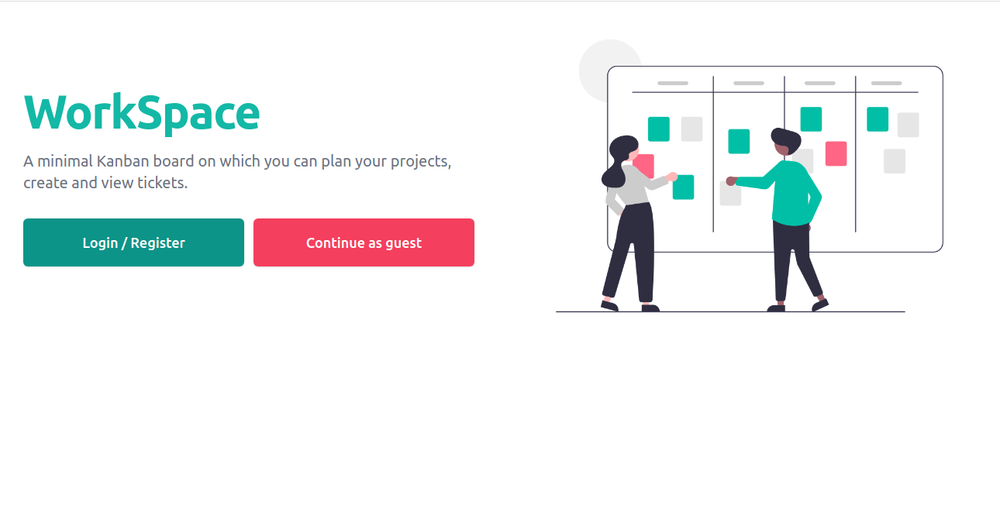
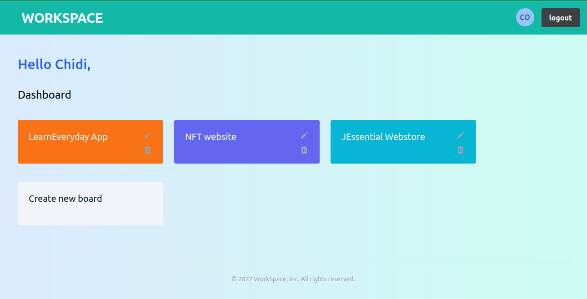
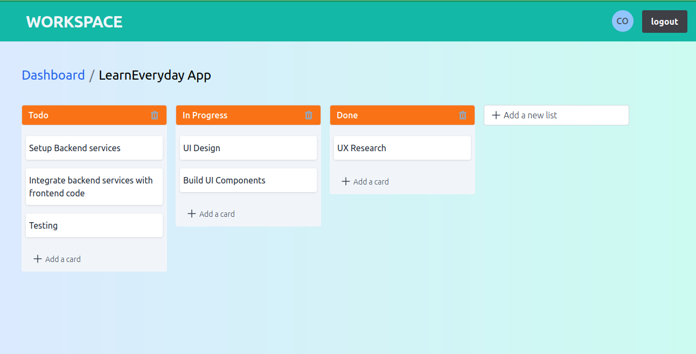

# WorkSpace

A simple Kanban board implementation used to plan personal and work projects.
[Website](https://)

## Features

- Users can sign in with Email, Google and as Guest.
- Add mutiple boards, lists and tickets.
- Reorder tickets on different lists

## Screenshoots

1. Displays home page with signin buttons.
   

2. Displays signed in user with user boards.
   

3. Displays signed in user with each user board content including lists and tickets.
   

## Installation

You would need to have [Node.js](https://nodejs.org/en/) and [yarn](https://yarnpkg.com/) installed.

To install dependencies, you can run:

```bash
yarn
```

## Running the project

To run the project locally, in the project directory, run:

```bash
yarn start
```

Runs the app in the development mode.<br />
Open [http://localhost:3000](http://localhost:3000) to view it in the browser.

## Technologies used

- React and TypeScript: used to build the UI components
- Styled components and SASS: for styling
- React Query: for managing server state
- React testing library and MSW : for unit and integration tests
- Cypress : for end-to-end tests
- Eslint for linting and Prettier for code formating
